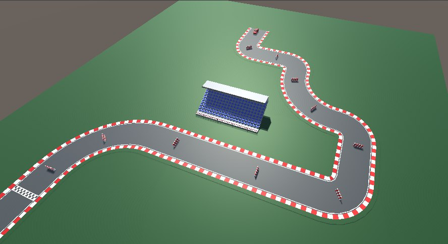
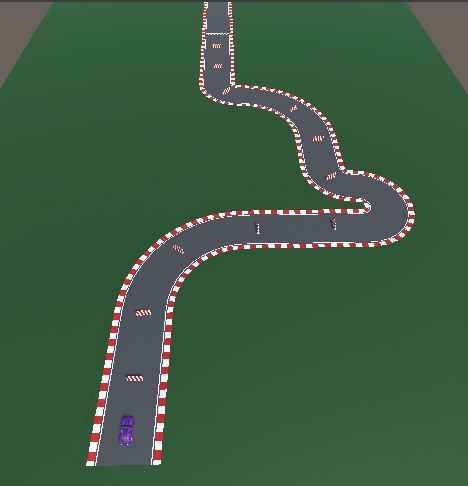
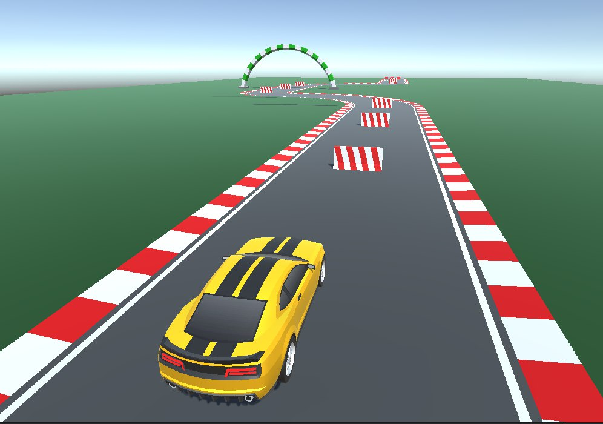

<h1>Racing Game</h1>

Passing the tracks with barriers.

<ul>
  <li>Windows</li>
  <li>Landscape orientation</li>
</ul>

<h2>Concept:</h2>

The main character - racnig car.

The project is a racing track with barriers which the player must avoid while driving to the finish line.

The UI is relatively minimalistic: "start", choice of "difficulty level" and "exit".

<h2>Life cycle:</h2>
<ol>
  <li>Launch/start the game by pressing the «START» button in the start menu.</li>
  <li>Screen with the firts level.</li>
  <li>Passing the racing track from the START point to the FINISH point, avoiding barriers.
</li>
  <li>The player wins when he successfully reaches the «FINISH» line. The «You won» screen is activated, showing the points earned, and also offering to play the game again by pressing the «RESTART» button. The transition to point 1 occurs.
</li>
</ol>

<h2>List of Mechanics and Features:</h2>

<ul>
  <li>View: Third-person</li>
  <li>Platform: PC</li>
  <li>Controls: Keyboard (W, A, S, D or Arrow Keys) and Mouse (for menu)</li>
  <li>Levels: 3 levels</li>
  <li>Difficulty: Speed increases with each subsequent level</li>
  <li>Movement Zones: Road</li>
  <li>Speed Control: Not available; speed is fixed for each level</li>
  <li>Audio: Background music is present</li>
  <li>Visuals: Simplified. Includes a road, obstacles, and a simplified landscape – a green background around the road simulating grass, a finish line.</li>
  <li>Damage Visualization: Yes</li>
</ul>

<figure>
   
   <figcaption>Picture 1 - Level 1</figcaption>
  </figure>

<figure>
   
   <figcaption>Picture 2 - Level 2</figcaption>
  </figure>

<figure>
   
   <figcaption>Picture 3 - Level 3</figcaption>
  </figure>

<h2>Build:</h2>

The project build can be downloaded from the following link:

<href>https://drive.google.com/drive/folders/1z7Iwz9mDxn-Se7nz2GD5uKlqZiCrbak8?usp=drive_link</href>
<h2>Launch instructions:</h2>

1. Download the project build from the link.

2. Unzip the downloaded files if they were downloaded as an archive.

3. Launch My project.exe.

